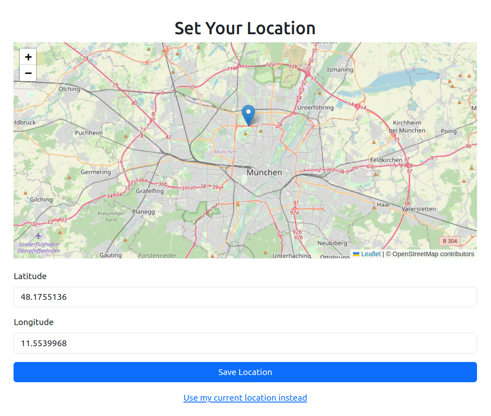
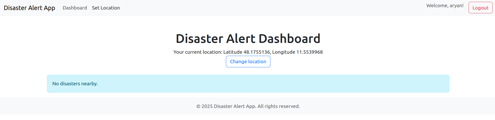

# Disaster Alert App

A disaster alert system that sends real-time alerts to users in affected regions.

# Project Structure

```
DisasterAlertApp/
├── alerts/                     # Main application directory
├── db.sqlite3                  # SQLite database file
├── DisasterAlertApp/          # Project configuration directory
├── docs/                      # Documentation files
├── manage.py                  # Django management script
├── README.md                  # Project documentation
└── requirements.txt           # Python dependencies
```

## Directory Details

### alerts/

The main application directory containing the core functionality for disaster alerts. This includes:

- Models for alert data
- Views for handling alert logic
- Templates for displaying alerts
- URL routing configurations

### DisasterAlertApp/

The project's main configuration directory containing:

- `settings.py`: Project settings and configurations
- `urls.py`: Main URL routing
- `wsgi.py`: WSGI application configuration
- `asgi.py`: ASGI application configuration

### docs/

Contains project documentation including:

- Technical specifications
- API documentation
- Installation instructions

### Additional Files

- `manage.py`: Django's command-line utility for administrative tasks
- `db.sqlite3`: SQLite database file (should be excluded from version control)
- `requirements.txt`: Lists all Python dependencies for easy installation

# Project Setup

See [installation instructions](docs/installation.md) to set up the project.

### Screenshots




